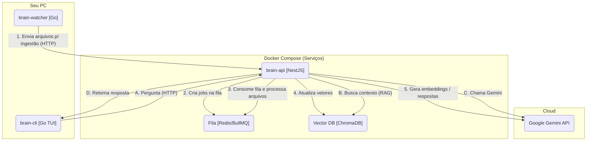

<div align="center">

# 🧠 Brain  

**Seu segundo cérebro pessoal, 100% self‑hosted, conectado ao seu ambiente de desenvolvimento.**

`Go` • `NestJS` • `Docker` • `Redis` • `ChromaDB` • `RAG` • `Google Gemini`

</div>

---

### 🔍 O que é o Brain?

`Brain` é um **segundo cérebro pessoal self-hosted** que transforma seus arquivos (dotfiles, configs, notas, código, projetos) em uma base de conhecimento consultável via **chat em linguagem natural**.

Você faz perguntas pelo terminal, e o Brain responde usando **RAG (Retrieval-Augmented Generation)**, buscando contexto diretamente nos seus arquivos locais antes de gerar a resposta com IA — **sem depender de SaaS de terceiros para armazenamento**.

> Ideal para mostrar em portfolio como um projeto de **engenharia de plataformas + IA aplicada + arquitetura distribuída**.

---

### ✨ Destaques Técnicos

- **Arquitetura distribuída com múltiplos serviços**
  - `brain-api` em **NestJS** (Node.js)
  - `brain-watcher` em **Go** (monitoramento de filesystem + envio assíncrono para API)
  - `brain-cli` em **Go + Bubble Tea** (interface TUI de chat)
  - Infra composta por **Redis** (fila), **ChromaDB** (vetores) e **Google Gemini** (LLM)

- **Agente ReAct orquestrando ferramentas**
  - Usa **LangChain Agents (ReAct)** com um tool de busca (`search_files`) conectado ao vector store
  - O agente decide quando consultar seus arquivos e quando raciocinar “só na cabeça”
  - Tratamento de erros do output do LLM para extrair a **“Final Answer”** mesmo quando o modelo foge do formato esperado

- **Re-ranking semântico opcional**
  - Integração com **Cohere Rerank** (`rerank-multilingual-v3.0`) quando `COHERE_API_KEY` está configurada
  - Primeiro faz uma busca densa no Chroma, depois aplica **re-ranking** para ordenar os documentos mais relevantes
  - Fallback automático para a busca padrão caso o reranker não esteja disponível ou falhe

- **Chunking adaptativo por tipo de arquivo**
  - Detecção de linguagem a partir da extensão (`.go`, `.ts`, `.py`, `.md`, `.html`, etc.)
  - **Markdown**: usa `MarkdownTextSplitter` preservando títulos, listas e blocos de código
  - **Código**: usa `RecursiveCharacterTextSplitter.fromLanguage` com separadores específicos de linguagem, chunk maior e overlap maior para preservar funções/classes
  - **Texto / configs genéricas**: splitter recursivo com hierarquia de separadores (`\n\n`, `\n`, frases, palavras) e parâmetros otimizados para textos planos
  - Estratégia “delete‑then‑add” por arquivo, garantindo que a coleção vetorial esteja sempre alinhada à última versão do arquivo

- **RAG end-to-end self-hosted**
  - Indexação de arquivos em background, com filtros híbridos (whitelist de extensões + blocklist de diretórios)
  - Armazenamento vetorial com **ChromaDB**
  - Consulta contextualizada antes de chamar o modelo do Gemini

- **Resiliência e escalabilidade**
  - Uso de **BullMQ + Redis** para enfileirar ingestão de arquivos
  - Watcher desacoplado da API, enviando via HTTP com cooldown e filtragem de conteúdo
  - Arquitetura pensada para rodar tudo em **containers Docker** com `docker-compose`

- **Experiência de desenvolvedor**
  - TUI em Go que roda com um simples `brain` no terminal
  - Configuração via `.env` e arquivo de `scan.paths` com expansão de `~/`
  - Possibilidade de rodar em modo "tudo Docker" ou "API local + infraestrutura em Docker"

---

### 🧩 Visão Geral da Arquitetura

Este repositório é um **monorepo** com 3 serviços principais, orquestrados via Docker Compose:

- `brain-api/` – API em NestJS (ingestão, RAG, integração com Gemini, fila)
- `brain-watcher/` – watcher em Go (fsnotify + filtros + HTTP client)
- `brain-cli/` – CLI/TUI em Go (Bubble Tea) para conversar com o Brain



---

### ✅ Funcionalidades atuais

- **Indexação inteligente de arquivos locais**
  - Scan inicial dos caminhos configurados (dotfiles, repositórios, documentos etc.)
  - Filtro de diretórios ruidosos (`node_modules`, `.git`, `dist`, `build`, caches, Steam, Discord, etc.)
  - Whitelist de extensões de texto e arquivos de configuração comuns (`.go`, `.ts`, `.js`, `.json`, `.md`, `.conf`, `.sh`, etc.)
  - Limite de tamanho por arquivo para evitar ingestão de arquivos gigantes

- **Monitoramento contínuo (Watcher em Go)**
  - Usa `fsnotify` para receber eventos do sistema de arquivos
  - Aplica **cooldown** por arquivo para evitar spam em mudanças rápidas
  - lê conteúdo, aplica filtro de MIME type (`text/*`) e envia para a API

- **Chat em linguagem natural pelo terminal**
  - Comando único `brain` abre a interface TUI
  - Histórico de mensagens na sessão
  - Usa a API do cérebro para buscar contexto e responder com Gemini

- **Infraestrutura containerizada**
  - `docker-compose.yml` sobe API, watcher, Redis, ChromaDB
  - Permite rodar tudo em modo "produção dev" ou apenas infra + API local em modo dev

---

### 🧱 Stack & Skills demonstradas

- **Linguagens:** Go, TypeScript (NestJS), JavaScript/TS para backend
- **Infra & DevOps:** Docker, Docker Compose, Redis, ChromaDB
- **Arquitetura de Software:** RAG, filas assíncronas, serviços desacoplados, watch de filesystem
- **Developer Experience:** CLI/TUI amigável, configuração via `.env`, monorepo organizado

---

### 🚀 Como rodar o projeto

#### Pré-requisitos

- [Docker](https://www.docker.com/) e [Docker Compose](https://docs.docker.com/compose/)
- [Node.js e npm](https://nodejs.org/) (se quiser desenvolver a API localmente)
- [Go](https://go.dev/) (para compilar a CLI)
- Uma chave de API do [Google AI Studio](https://aistudio.google.com/app/apikey)

#### 1. Clonar o repositório

```bash
git clone https://github.com/seu-usuario/Brain.git
cd Brain
```

#### 2. Configurar variáveis de ambiente

Copie o arquivo de exemplo e ajuste com seus valores:

```bash
cp env.example .env
nano .env  # ou seu editor preferido
```

Configure pelo menos:

```ini
# .env

# Chave da API do Google Gemini (obrigatório)
GOOGLE_API_KEY=AIzaSy... (sua chave real)

# Caminho para o arquivo de scan paths (obrigatório)
# Use caminho ABSOLUTO, não ~/
SCAN_PATHS_FILE=/home/seu_usuario/.config/brain/scan.paths

# Caminho base para montar no Docker (obrigatório)
SCAN_PATHS_MOUNT=/home/seu_usuario

# URL da API usada pelo watcher (padrão recomendado para Docker local)
API_URL=http://host.docker.internal:3000/queue/ingest
```

> **Importante:** use sempre caminhos **absolutos** no `.env` (não use `~/`).

#### 3. Definir os caminhos que o Brain deve conhecer

O watcher só indexa o que você explicitamente configura no arquivo apontado por `SCAN_PATHS_FILE`.

```bash
mkdir -p ~/.config/brain
nano ~/.config/brain/scan.paths
```

Exemplo de conteúdo:

```ini
# ~/.config/brain/scan.paths

# Dentro deste arquivo você PODE usar ~/ (será expandido automaticamente)

# Meus dotfiles
~/.config/hypr
~/.config/waybar
~/.config/kitty/kitty.conf
~/.zshrc

# Meus repositórios
~/Repos

# Caminhos absolutos adicionais
/home/seu_usuario/Documents
```

#### 4. Subir os serviços

**Opção A – Tudo via Docker (mais simples)**

```bash
docker compose up -d --build
```

Isso irá:

1. Construir as imagens de `brain-api` e `brain-watcher`
2. Subir os 4 containers (`api`, `watcher`, `db`, `queue`)
3. Iniciar o **Scan Inicial (Fase 1)** em todos os caminhos definidos

**Opção B – Desenvolvimento da API localmente**

```bash
# Suba apenas os serviços de infraestrutura
docker compose up -d db queue watcher

# Em outro terminal, rode a API localmente
cd brain-api
npm install
npm run start:dev
```

Assim você tem **hot-reload** da API, mantendo watcher, Redis e ChromaDB em containers.

Para mais detalhes de desenvolvimento, consulte `DEVELOPMENT.md` (quando estiver disponível).

#### 5. Acompanhar logs

```bash
# Logs de todos os serviços
docker compose logs -f

# Logs apenas da API
docker compose logs -f api

# Logs apenas do watcher
docker compose logs -f watcher
```

> O primeiro scan pode levar alguns minutos, dependendo da quantidade de arquivos.

---

### 💬 Usando o Brain no dia a dia

Depois que o scan inicial terminar, você já pode conversar com seu segundo cérebro:

```bash
brain
```

Isso abre a interface TUI. Digite sua pergunta, pressione `Enter`. Para sair, `Ctrl+C`.

**Exemplos de perguntas reais:**

- `Qual a fonte que eu uso no kitty.conf?`
- `Qual o atalho de teclado para o terminal no meu hyprland.conf?`
- `Me explique o que o projeto 'backend.fork' faz.`
- `Qual é o meu alias 'll' no .zshrc?`

---

### 🔧 Desenvolvimento & próximos passos

Se você quiser evoluir o Brain (ou mostrar ideias em entrevistas), alguns caminhos interessantes:

- **Melhorar a experiência de chat na CLI**
  - histórico persistente
  - múltiplos perfis de cérebro (work, pessoal, estudos)
- **Adicionar autenticação / multiusuário na API**
- **Suporte a outros provedores de LLM**
  - OpenAI, Claude, etc.
- **Dash de observabilidade**
  - métricas de ingestão, latência de resposta, tamanho do índice, etc.

---

### ⚙️ Variáveis de ambiente (resumo)

Principais variáveis configuráveis no `.env`:

| Variável         | Descrição                                      | Obrigatório | Padrão                                           |
|------------------|------------------------------------------------|-------------|--------------------------------------------------|
| `GOOGLE_API_KEY` | Chave da API do Google Gemini                  | ✅ Sim      | -                                                |
| `SCAN_PATHS_FILE`| Caminho absoluto para o arquivo de scan paths  | ✅ Sim      | -                                                |
| `SCAN_PATHS_MOUNT`| Caminho base montado no Docker                | ✅ Sim      | -                                                |
| `API_URL`        | URL da API usada pelo watcher                  | ❌ Não      | `http://host.docker.internal:3000/queue/ingest` |
| `REDIS_HOST`     | Host do Redis (quando API local)               | ❌ Não      | `localhost`                                      |
| `CHROMA_HOST`    | Host do ChromaDB (quando API local)            | ❌ Não      | `localhost`                                      |

Veja também o arquivo `env.example` para a lista completa.

---

### 📜 Licença

Este projeto está sob a licença MIT. Veja `LICENSE` para mais detalhes.
