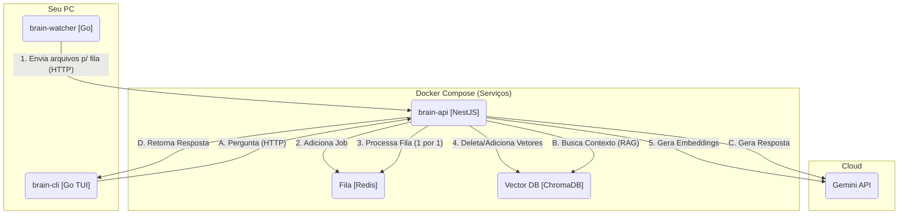

# 🧠 Brain: Seu Cérebro Pessoal Self-Hosted

`Brain` é um sistema de "segundo cérebro" pessoal, 100% self-hosted. Ele monitora, indexa e armazena o conteúdo de todos os seus arquivos importantes (como dotfiles, notas e código-fonte) em um banco de dados vetorial.

Através de uma CLI de chat (TUI), você pode fazer perguntas em linguagem natural e obter respostas instantâneas geradas por IA, com base *exclusivamente* no seu próprio conhecimento.

### ✨ Funcionalidades Principais

  * **🧠 Cérebro (API):** Uma API robusta em **NestJS** que gerencia a ingestão, o RAG e a comunicação com a IA.
  * **👂 Ouvidos (Watcher):** Um serviço leve em **Go** que monitora ativamente seus arquivos (`~/.config`, `~/Repos`, etc.) e envia alterações para a fila.
  * **🗣️ Boca (CLI):** Uma interface de chat (TUI) "bonita" em **Go (Bubble Tea)** para fazer perguntas ao seu cérebro de qualquer terminal.
  * **⚙️ Arquitetura de Fila:** Usa **Redis** e **BullMQ** para garantir que nenhuma indexação de arquivo seja perdida, mesmo que a API esteja offline ou sobrecarregada.
  * **💾 Persistência Vetorial:** Usa **ChromaDB** para armazenar os *embeddings* (vetores) dos seus arquivos.
  * **🐳 100% Dockerizado:** Todos os 4 serviços (API, Watcher, Redis, ChromaDB) são orquestrados com um único arquivo `docker-compose.yml`.

-----

### 🏗️ Arquitetura do Sistema

Este projeto é um **Monorepo** que contém 3 serviços principais orquestrados pelo Docker Compose.



-----

### 🚀 Como Rodar

#### Pré-requisitos

  * [Docker](https://www.docker.com/) e [Docker Compose](https://docs.docker.com/compose/)
  * [Node.js e npm](https://nodejs.org/) (para desenvolvimento local da API)
  * [Go](https://go.dev/) (para compilar a CLI)
  * Uma Chave de API do [Google AI Studio](https://aistudio.google.com/app/apikey)

#### 1\. Configuração

1.  **Clone o repositório:**

    ```bash
    git clone https://github.com/seu-usuario/Brain.git
    cd Brain
    ```

2.  **Configure o arquivo `.env`:**
    
    Copie o arquivo de exemplo e edite com suas configurações:

    ```bash
    cp env.example .env
    nano .env  # ou use seu editor preferido
    ```

    Configure as variáveis obrigatórias:

    ```ini
    # .env
    
    # Chave da API do Google Gemini (obrigatório)
    GOOGLE_API_KEY=AIzaSy... (sua chave real)
    
    # Caminho para o arquivo de scan paths (obrigatório)
    # Use caminho ABSOLUTO, não ~/
    SCAN_PATHS_FILE=/home/seu_usuario/.config/brain/scan.paths
    
    # Caminho base para montar no Docker (obrigatório)
    # Geralmente seu diretório home
    SCAN_PATHS_MOUNT=/home/seu_usuario
    
    # URL da API (opcional, padrão funciona para desenvolvimento local)
    API_URL=http://host.docker.internal:3000/queue/ingest
    ```

    **⚠️ Importante:** Use sempre caminhos **absolutos** no `.env`, não use `~/`.

3.  **Crie seu arquivo de scan paths:**
    
    O *watcher* só indexará os arquivos e pastas que você listar neste arquivo. Crie o arquivo definido em `SCAN_PATHS_FILE`:

    ```bash
    mkdir -p ~/.config/brain
    nano ~/.config/brain/scan.paths  # ou use o caminho que você configurou no .env
    ```

    Adicione os caminhos que você quer indexar (exemplo):

    ```ini
    # ~/.config/brain/scan.paths
    
    # Dentro deste arquivo, você PODE usar ~/ que será expandido automaticamente
    
    # Meus dotfiles
    ~/.config/hypr
    ~/.config/waybar
    ~/.config/kitty/kitty.conf
    ~/.zshrc

    # Meus repositórios
    ~/Repos
    
    # Ou use caminhos absolutos
    /home/seu_usuario/Documents
    ```

#### 2\. Iniciando os Serviços

**Opção A: Tudo no Docker (Produção/Simples)**

Com o Docker Desktop rodando, suba todos os serviços em segundo plano:

```bash
docker compose up -d --build
```

Isso irá:

1.  Construir as imagens da `brain-api` e `brain-watcher`.
2.  Iniciar os 4 containers (`api`, `watcher`, `db`, `queue`).
3.  O `watcher` iniciará o **"Scan Inicial (Fase 1)"**.

**Opção B: Desenvolvimento Local (API local + outros no Docker)**

Para desenvolvimento, você pode rodar a API localmente e os outros serviços no Docker:

```bash
# Suba apenas os serviços de infraestrutura
docker compose up -d db queue watcher

# Em outro terminal, rode a API localmente
cd brain-api
npm install
npm run start:dev
```

Isso permite hot-reload e debug mais fácil da API.

📖 **Para mais detalhes sobre desenvolvimento local, veja [DEVELOPMENT.md](./DEVELOPMENT.md)**

---

**Acompanhar os logs:**

```bash
# Logs de todos os serviços
docker compose logs -f

# Logs apenas da API
docker compose logs -f api

# Logs apenas do watcher
docker compose logs -f watcher
```

*(**Nota:** O primeiro scan pode levar vários minutos, pois a fila está processando seus arquivos (um por um) de forma segura.)*

#### 3\. Instalando a CLI

Para usar o comando `brain` de qualquer lugar do seu sistema:

```bash
cd brain-cli
go install .
cd ..
```

*(Isso compila a CLI e a move para a sua pasta `~/go/bin/`).*

-----

### 💬 Como Usar

Assim que o "Scan Inicial" estiver concluído, você pode começar a conversar com seu cérebro.

Basta rodar o comando em qualquer terminal:

```bash
brain
```

Isso abrirá a interface de chat (TUI). Digite sua pergunta e pressione `Enter`. Para sair, pressione `Ctrl+C`.

**Exemplos de Perguntas:**

  * `Qual a fonte que eu uso no kitty.conf?`
  * `Qual o atalho de teclado para o terminal no meu hyprland.conf?`
  * `Me explique o que o projeto 'backend.fork' faz.`
  * `Qual é o meu alias 'll' no .zshrc?`

-----

### 🔧 Desenvolvimento

Para desenvolvedores que querem modificar o código:

📖 **Veja o guia completo em [DEVELOPMENT.md](./DEVELOPMENT.md)**

**Resumo rápido:**
- Configure o `.env` com suas variáveis de ambiente
- Rode apenas os serviços necessários: `docker compose up -d db queue watcher`
- Desenvolva a API localmente: `cd brain-api && npm run start:dev`
- A API se conecta automaticamente aos serviços no Docker

### ⚙️ Variáveis de Ambiente

Principais variáveis que você pode configurar no `.env`:

| Variável | Descrição | Obrigatório | Padrão |
|----------|-----------|-------------|--------|
| `GOOGLE_API_KEY` | Chave da API do Google Gemini | ✅ Sim | - |
| `SCAN_PATHS_FILE` | Caminho absoluto para o arquivo de scan paths | ✅ Sim | - |
| `SCAN_PATHS_MOUNT` | Caminho absoluto base para montar no Docker | ✅ Sim | - |
| `API_URL` | URL da API para o watcher | ❌ Não | `http://host.docker.internal:3000/queue/ingest` |
| `REDIS_HOST` | Host do Redis (quando API local) | ❌ Não | `localhost` |
| `CHROMA_HOST` | Host do ChromaDB (quando API local) | ❌ Não | `localhost` |

Veja o arquivo `env.example` para todas as opções disponíveis.
