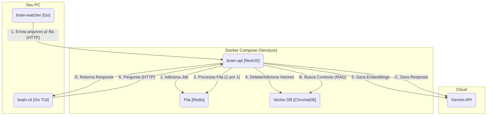

# 🧠 Brain: Seu Cérebro Pessoal Self-Hosted

`Brain` é um sistema de "segundo cérebro" pessoal, 100% self-hosted. Ele monitora, indexa e armazena o conteúdo de todos os seus arquivos importantes (como dotfiles, notas e código-fonte) em um banco de dados vetorial.

Através de uma CLI de chat (TUI), você pode fazer perguntas em linguagem natural e obter respostas instantâneas geradas por IA, com base *exclusivamente* no seu próprio conhecimento.

### ✨ Funcionalidades Principais

  * **🧠 Cérebro (API):** Uma API robusta em **NestJS** que gerencia a ingestão, o RAG e a comunicação com a IA.
  * **👂 Ouvidos (Watcher):** Um serviço leve em **Go** que monitora ativamente seus arquivos (`~/.config`, `~/Repos`, etc.) e envia alterações para a fila.
  * **🗣️ Boca (CLI):** Uma interface de chat (TUI) "bonita" em **Go (Bubble Tea)** para fazer perguntas ao seu cérebro de qualquer terminal.
  * **⚙️ Arquitetura de Fila:** Usa **Redis** e **BullMQ** para garantir que nenhuma indexação de arquivo seja perdida, mesmo que a API esteja offline ou sobrecarregada.
  * **💾 Persistência Vetorial:** Usa **ChromaDB** para armazenar os *embeddings* (vetores) dos seus arquivos.
  * **🐳 100% Dockerizado:** Todos os 4 serviços (API, Watcher, Redis, ChromaDB) são orquestrados com um único arquivo `docker-compose.yml`.

-----

### 🏗️ Arquitetura do Sistema

Este projeto é um **Monorepo** que contém 3 serviços principais orquestrados pelo Docker Compose.



-----

### 🚀 Como Rodar

#### Pré-requisitos

  * [Docker](https://www.docker.com/) e [Docker Compose](https://docs.docker.com/compose/)
  * [Go (para compilar a CLI)](https://go.dev/)
  * Uma Chave de API do [Google AI Studio](https://aistudio.google.com/app/apikey)

#### 1\. Configuração

1.  **Clone o repositório:**

    ```bash
    git clone https://github.com/seu-usuario/Brain.git
    cd Brain
    ```

2.  **Crie seu arquivo `.env`:**
    Crie um arquivo `.env` na raiz do projeto e adicione sua chave de API:

    ```ini
    # .env
    GOOGLE_API_KEY=AIzaSy... (sua chave real)
    ```

3.  **Crie sua "Whitelist" (`scan.paths`):**
    O *watcher* só indexará os arquivos e pastas que você listar aqui. Crie o arquivo:

    ```bash
    mkdir -p ~/.config/brain
    touch ~/.config/brain/scan.paths
    ```

    Adicione os caminhos que você quer indexar (exemplo):

    ```ini
    # ~/.config/brain/scan.paths

    # Meus dotfiles
    /home/nisio/.config/hypr
    /home/nisio/.config/waybar
    /home/nisio/.config/kitty/kitty.conf
    /home/nisio/.zshrc

    # Meus repositórios
    /home/nisio/Repos
    ```

#### 2\. Iniciando os Serviços (Docker Compose)

Com o Docker Desktop rodando, suba todos os serviços em segundo plano:

```bash
docker compose up -d --build
```

Isso irá:

1.  Construir as imagens da `brain-api` e `brain-watcher`.
2.  Iniciar os 4 containers (`api`, `watcher`, `db`, `queue`).
3.  O `watcher` iniciará o **"Scan Inicial (Fase 1)"**.

Você pode acompanhar o progresso da indexação (ou os logs da API) com:

```bash
docker compose logs -f api
```

*(**Nota:** O primeiro scan pode levar vários minutos, pois a fila está processando seus arquivos (um por um) de forma segura.)*

#### 3\. Instalando a CLI

Para usar o comando `brain` de qualquer lugar do seu sistema:

```bash
cd brain-cli
go install .
cd ..
```

*(Isso compila a CLI e a move para a sua pasta `~/go/bin/`).*

-----

### 💬 Como Usar

Assim que o "Scan Inicial" estiver concluído, você pode começar a conversar com seu cérebro.

Basta rodar o comando em qualquer terminal:

```bash
brain
```

Isso abrirá a interface de chat (TUI). Digite sua pergunta e pressione `Enter`. Para sair, pressione `Ctrl+C`.

**Exemplos de Perguntas:**

  * `Qual a fonte que eu uso no kitty.conf?`
  * `Qual o atalho de teclado para o terminal no meu hyprland.conf?`
  * `Me explique o que o projeto 'backend.fork' faz.`
  * `Qual é o meu alias 'll' no .zshrc?`
